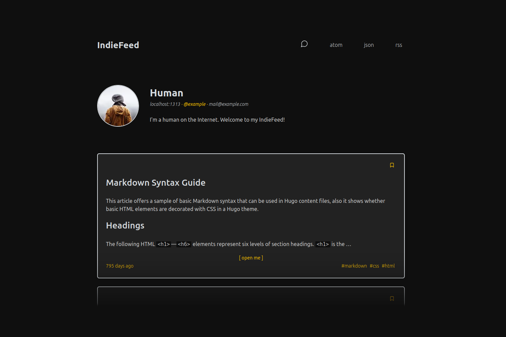
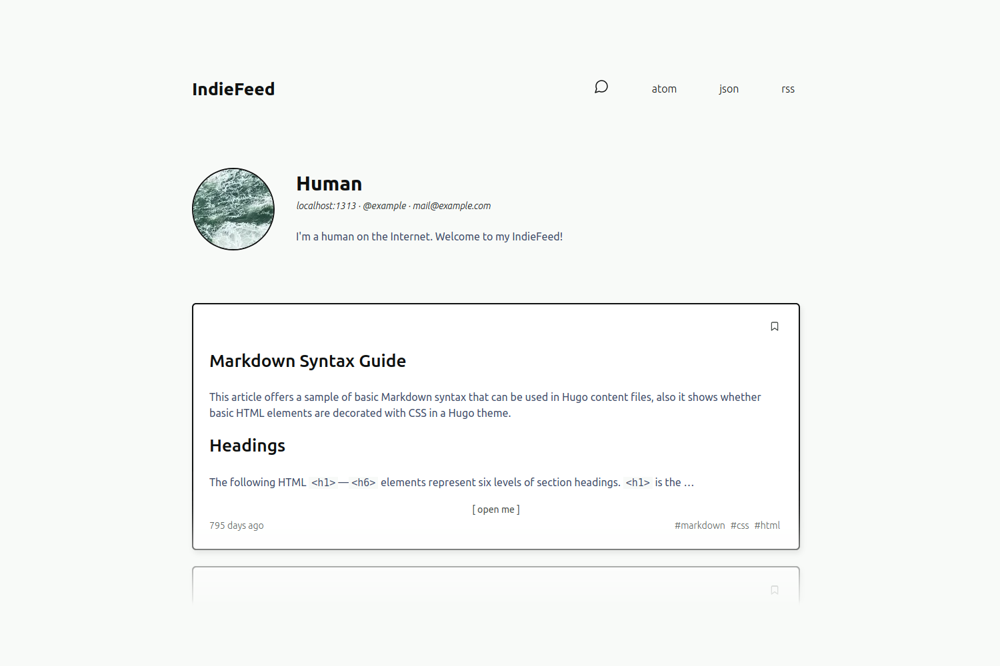

# IndieFeed  

A [Hugo](https://gohugo.io/) theme for the independent web.

- Perfectly parsed by readers with [microformats2](https://microformats.org/wiki/microformats2) support: [h-card](https://microformats.org/wiki/h-card), [h-feed](https://microformats.org/wiki/h-feed), [h-entry](https://microformats.org/wiki/h-entry)
- [Webmention](https://www.w3.org/TR/webmention/) rendering and built-in support via [Webmention.io](https://webmention.io/)
- [POSSE](https://indieweb.org/POSSE) support via [Bridgy](https://brid.gy/)
- [IndieAuth](https://indieweb.org/IndieAuth) built in (see [head.html](layouts/partials/head.html) for supported links -- submit a PR to add one!)

*If you're like, (☉_☉) "What do all these funny words mean?" Don't worry! Read the [explainer.](./OTHER_README.md)*

## Screenshots




## Getting Started

If you are new to the Hugo framework, fret not! It's a very popular and friendly static site generator. Check out the [quickstart](https://gohugo.io/getting-started/quick-start/) to create your site, then:

1. Add this theme to your site
2. Update your `config.{toml, yaml, json}`
3. Join the IndieWeb community with your own independent site!

### 1. Add this theme

To add this theme to your Hugo site, run this from the root directory:

```sh
git submodule add https://github.com/dianoetic/indiefeed.git themes/indiefeed
```

### 2. Update your `config`

Copy the [example configuration file](./exampleSite/config.yaml) to your root directory and update settings as needed.

Be sure to replace each `example` or `example.com` with your own domain!

### 3. Welcome to #indieweb! 🎉

[Add some content](https://gohugo.io/getting-started/quick-start/#step-4-add-some-content) and deploy your site! You can deploy automatically with any of these:

- GitHub Actions ([there's one included!](./exampleSite/.github/workflows/build.yaml)) to [GitHub Pages](https://pages.github.com/)
- [GitLab Pages](https://docs.gitlab.com/ee/user/project/pages/)
- [Netlify](https://docs.netlify.com/configure-builds/common-configurations/hugo/)
- ...or on your own server!

Once your site is deployed, you may also like to:

- Set up your [Webmentions](https://www.w3.org/TR/webmention/) by signing in with [IndieAuth](https://indieweb.org/IndieAuth) at [Webmention.io](https://webmention.io/)
- Learn about [POSSE](https://indieweb.org/POSSE) and sign into [Bridgy](https://brid.gy/)
- Come say hello to the folks hanging out at [IndieWebCamp](https://indieweb.org/discuss) and introduce yourself (and your website)!

## Categories

IndieFeed will conditionally display aspects of posts depending on the category you put in your front matter:

- `note`: no title displayed
- `reply`: displays title, reply icon, and includes [reply markup for h-entry](https://microformats.org/wiki/h-entry)
- Anything else: displays title

## Preview and Validation

Serve your site locally using Hugo's **development server**: `hugo server`. See [Hugo server docs](https://gohugo.io/commands/hugo_server/#readout) for options.

Validate your **h-card** with [IndieWebify.me](https://indiewebify.me/validate-h-card/).

Preview your **h-feed** with [Monocle's preview tool](https://monocle.p3k.io/preview).

Alternative feeds ([custom output formats](https://gohugo.io/templates/output-formats#readout)) can be configured in `config.yaml`. See the [example configuration](./exampleSite/config.yaml) for... well, examples.

**Atom** and **RSS** can be validated with the [W3C Feed Validation Service](https://validator.w3.org/feed/).

## Customizing

Add your own CSS styles with the following setting in your `config.{toml, yaml, json}`:

```yaml
params:
  customCSS: css/style.css # relative to ./static/
```

Any CSS in `./static/css/style.css` will override theme defaults.

Choose a [syntax highlighting theme](https://xyproto.github.io/splash/docs/all.html) with this setting:

```yaml
markup:
  highlight:
    style: dracula
```

You can also override any templates by placing replacements with the same names in your `./layouts/` directory.

## Contributions

Yes! All the things! ヽ(*^▽^)ﾉ
